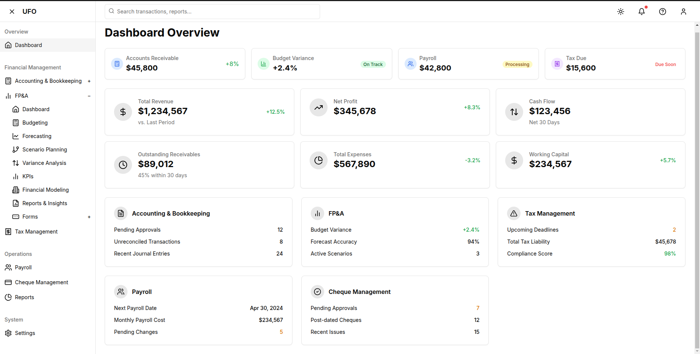

# Unified Financial System Software

Integrates Accounting and Bookkeeping, Financial Planning and Analysis (FP&A), Tax Management and Compliance, Payroll, and Cheque Management System would result in a robust enterprise-grade platform.

